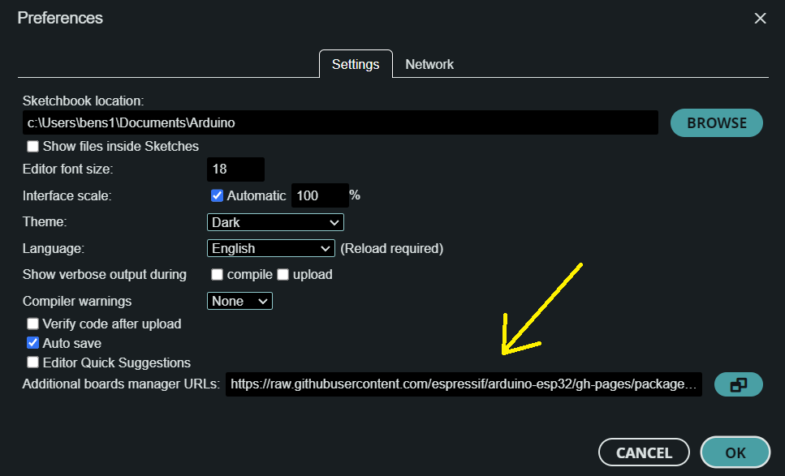
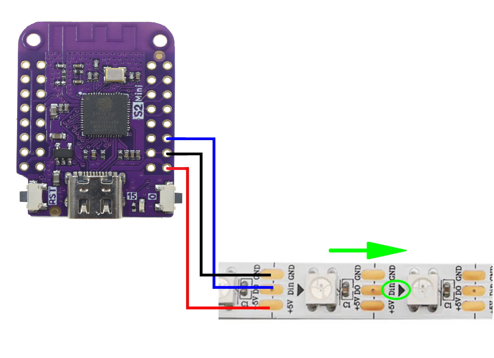

# Smart Lanterns

## Presented by ICRS

## `Introduction`

TIME: ~ 2.5hr

LINK: [https://github.com/ICRS/smart-lanterns](https://github.com/ICRS/smart-lanterns)


## `Format of the event`

This is a free event with the goal of sending everyone home with a smart lantern and a new set of skills. The event will be broken down into 5 parts:

**Intro**: We introduce ICRS and demonstrate briefly how to make the lanterns and explain what we will be doing.\
**Collab**: Breaking into teams of 3-5 working together to make one lantern.\
**Individual**: Using the process learned in the previous step to make the rest the new lanterns for the team.\
**Food**: Needed for survival by humans.\
**Outro**: Bring the group back together and going further with the lanterns, as well as exploring more options for this tech.

## `Step 1: Code`

The first step is to download the code for this project which you can do from here:

[https://github.com/ICRS/smart-lanterns](https://github.com/ICRS/smart-lanterns)

click the green code button then select `Download ZIP`


You should find these instructions in the README.md file.

## `Step 2: Get Software`

This project uses an Arduino which requires the Arduino IDE to run. **This has been pre-installed** on the ICRS computers so go ahead and boot it up. The icon looks like this:


If you are following along at home I recommend using [Arduino IDE 2.0 RC](https://www.arduino.cc/en/software#future-version-of-the-arduino-ide), but PlatformIO or Arduino version 1 are also supported.

## `Step 2.1: Board Manager`

To get the files we need for this specific Arduino, we need to download them in the board manager.

Update the board manager:
click `file > preferences > Additional board manager URLs` and paste this link into it `https://raw.githubusercontent.com/espressif/arduino-esp32/gh-pages/package_esp32_index.json`

then click `OK`.



Once this is done install the new board by clicking the board icon searching `esp32`. Then select version 2.0.14 and click `Install`.

> Note:
> esp32 versions 3.0.0 and newer are unstable and at the time of writing aren't compatible with FastLED which we will be installing next.


## `Step 2.2: Libraries`

Click on the library icon and search for `FastLED` and click install. Make sure to choose the latest version.


## `Step 2.3: Open Code`

Open the code in Arduino, all the files are located in the folder named `smart-lanterns`. You can open this by clicking `file > open` in the top left corner.

Feel free to have a look at the code and try to understand it!

## `Step 3: Hardware`

During the in person workshop we will provide you with a few components, these are:

- 1 - [Wemos ESP32-S2 Mini](https://www.wemos.cc/en/latest/s2/s2_mini.html) (which will be referred to as an "ESP")
- 0.5m - [60led/m 5050 addressable LEDs](https://www.aliexpress.com/item/1005001345392567.html?spm=a2g0o.order_list.0.0.21ef1802m8rokq)
- 3 - Jumper wires soldered to the LEDs (soldering not covered in the workshop)
- Double sided tape
- Masking tape
- [Lasercut corflute](./laser%20cutting.svg)
- [Lasercut 120gsm White Card](./laser%20cutting.svg)
- [Lasercut 120gsm Black Card](./laser%20cutting.svg)
- A USB-C cable

### `Step 3.1: Laser cutting (Pre-done)`

> Note:
> This step has been done for you already, so feel free to move onto step 3.2

Laser cut the paper following the file in the [laser cutting.svg](./laser%20cutting.svg) file, which should look roughly like this:


### `Step 3.2: Building the lantern`

Place the LED strip about 2-3 mm from the bottom of the card and stick it down using the double sided tape on the back of the LED strip. This is shown in the image below:


Next, stick the core flute to bottom edge of the card below the LED strip being **CAREFUL to not crease the card**

Lastly, stick the black card to the outside of the white card to hide the LED strip when the lights are on.

### `Step 3.3: Wiring`

The wiring has been done for you as shown in the image below.

- +5V -> VIN
- GND -> GND
- DIN -> 16



### `Step 3.4: Securing the ESP`

Once this is done, place the ESP in the hole in the core flute, with the wire traveling to the outside. Once the programing is done, and you are sure everything is working, place the masking tape under the ESP to prevent it falling out.

## `Step 4: Configuration`

### `Step 4.1: Configuration File`

Open the demo code in the Arduino IDE (Step 2.3)

Rename WIFI_SSID from `"my_light"` to something unique. Make sure to keep the quotation marks!

> Note:
> WIFI_SSID cannot have spaces in it.

### `Step 4.2: Pattern`

In the config file select a pattern by setting `PATTERN` to the pattern you would like. The pattern options are at the bottom of the file.

```C
#define PATTERN 1 // Change this number
```

## `Step 5: Upload Demo Code`

1. Plug the ESP into your laptop.
2. Select `LOLIN S2 Mini` in the top left. It might also say `select board`. Then click `Select other board and port...`
3. Type in `LOLIN S2 Mini` on the left hand column and select it.
4. In the right hand column, if there is anything there then click it and move on to 5. Otherwise you will need to restart the ESP in boot mode.\
This can be done by holding down both of the buttons on the ESP, and releasing the button labeled `RST` first.\
If a port still doesn't show up then ask a supervisor for help.
5. Click `ok`.
6. Click the upload button (the button in the top left of the screen with a right pointing arrow).
7. Wait for your code to compile and upload.

ADD VIDEO HERE!!!

## `Step 6: Connect Over WiFi`

Once the code has uploaded, you should see a WiFi network with the name you set in step 4.1.

Connect to this network the same way you would any other WiFi network. You can do this either with your laptop or your phone!

Next go to the URL [http://192.168.4.1/H](http://192.168.4.1/H) and you should see your light turn on. You can also turn it off from the same webpage.

## `Past the workshop:`

There are plenty of other cool things which can be done with the technology used in this project. Here are some examples you can try when you have finished:

### `What else can you make?`

Automated front door lock\
Automated garage door opener\
Automated switch (eg put in on a fan, heater kettle)\
Automating Air con\
Collect data from sensors\
Security System\
Mini webserver\
Automating 3D printers\
Mini security cam (ESP-32 CAM)\
Decor of various sorts\
Automate 3d printing\
Smart Speaker

What else????

### `Custom Patterns`

There are many other pattern options make with this, each LED can take a few different colours (about 16 million) but most would look too similar to each other to see, I would recommend using bright colours that are highly saturated.


